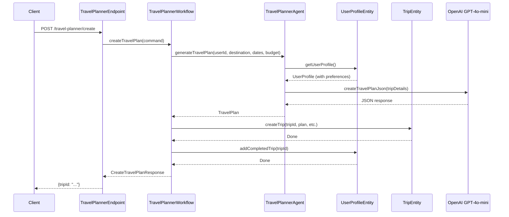
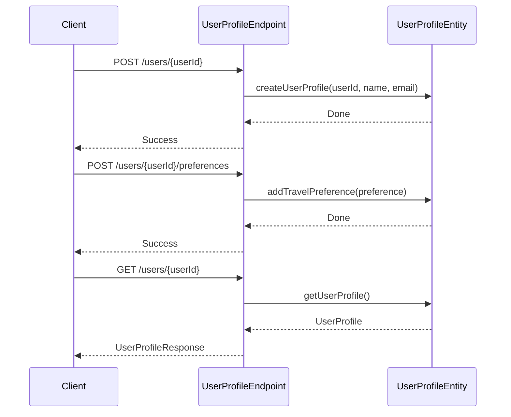

# Travel Planner Agent

The Travel Planner Agent is an AI-powered application built on the Akka SDK that helps users create personalized travel itineraries. The service leverages event sourcing and large language models (LLMs) to generate detailed travel plans based on user preferences and trip parameters.

This example illustrates how to interact with a LLM using the Agent component. Event Sourced Entity is used for durable state of user preferences and generated trips. It's using an Akka Workflow for reliable orchestration of the interactions.

To understand the Akka concepts that are the basis for this example, see [Development Process](https://doc.akka.io/concepts/development-process.html) in the documentation.

This project contains a skeleton to create an agentic AI service. To understand more about these components, see [Developing services](https://doc.akka.io/java/index.html). Other examples can be found [here](https://doc.akka.io/java/samples.html).

# Run locally

Provide your OpenAI API key in environment variable `OPENAI_API_KEY`.

To start your service locally, run:

```shell
mvn compile exec:java
```

## User Profile API

The Travel Planner service provides a REST API for managing user profiles. Below are examples of how to interact with the API using curl.

Create a new user profile with name and email:

```shell
curl -i localhost:9000/users/user-123 \
  --header "Content-Type: application/json" \
  -XPOST \
  --data '{"name":"John Traveler","email":"john@example.com"}'
```

Retrieve a user profile by ID:

```shell
curl -i localhost:9000/users/user-123
````

Update a user's name and email:

```shell
curl -i localhost:9000/users/user-123 \
  --header "Content-Type: application/json" \
  -XPATCH \
  --data '{"name":"John Updated","email":"john.updated@example.com"}'
```

Add a travel preference to a user's profile:

```shell
curl -i localhost:9000/users/user-123/preferences \
  --header "Content-Type: application/json" \
  -XPOST \
  --data '{
    "type": "ACCOMMODATION_TYPE",
    "value": "hotel",
    "priority": 5
  }'
```

Available preference types:

* ACCOMMODATION_TYPE (e.g., "hotel", "hostel", "apartment")
* TRANSPORTATION_TYPE (e.g., "flight", "train", "car")
* CUISINE (e.g., "italian", "vegetarian")
* ACTIVITY (e.g., "hiking", "museums", "beaches")
* CLIMATE (e.g., "warm", "cold", "moderate")
* BUDGET_RANGE (e.g., "budget", "mid-range", "luxury")

## Travel Planner API

Create a travel plan using the workflow, which will generate the plan, store it, and update the user's profile.
The response includes the trip ID.

```shell
curl -i localhost:9000/travel-planner/create \
  --header "Content-Type: application/json" \
  -XPOST \
  --data '{
    "userId": "user-123",
    "destination": "Paris, France",
    "startDate": "2025-06-15",
    "endDate": "2025-06-22",
    "budget": 2000.00
  }'
```

Get a trip by ID:

```shell
curl -i localhost:9000/travel-planner/trips/<tripId>
```

or as human readable text:

```shell
curl -i localhost:9000/travel-planner/trips/<tripId>/as-text
```

### Run tests

Run unit tests with:

```shell
mvn test
```

Integration tests require that you have defined the OpenAI API key in the environment variable `OPENAI_API_KEY`. Then run integration tests with:

```shell
mvn verify
```

## Deployment

Build container image:

```shell
mvn clean install -DskipTests
```

Install the `akka` CLI as documented in [Install Akka CLI](https://doc.akka.io/reference/cli/index.html).

Deploy the service using the image tag from above `mvn install`:

```shell
akka service deploy travel-agent travel-agent:tag-name --push
```

Refer to [Deploy and manage services](https://doc.akka.io/operations/services/deploy-service.html)
for more information.

## Architecture Overview

### System Components

The system consists of the following key components:

1. **Domain Models**: Core business entities like `UserProfile`, `TravelPreference`, and `TravelPlan`
2. **Entities**: Event-sourced entities that manage state changes (`UserProfileEntity`, `TripEntity`)
3. **Workflow**: Orchestrates the travel planning process (`TravelPlannerWorkflow`)
4. **Agent**: Interfaces with LLMs to generate travel plans (`TravelPlannerAgent`)
5. **HTTP Endpoints**: REST APIs for client interaction (`UserProfileEndpoint`, `TravelPlannerEndpoint`)

### Component Interactions

#### Travel Plan Creation Flow



#### User Profile Management Flow



### Key Technologies

- **Akka SDK**: Provides the foundation for building event-sourced, stateful services
- **Event Sourcing**: Used to track all state changes in the system
- **Langchain4j**: Java library for interacting with LLMs
- **OpenAI GPT-4o-mini**: The LLM used to generate travel plans

### Data Flow

1. **User Profile Creation**:
    - User data and preferences are stored in the `UserProfileEntity`
    - Each preference change is tracked as an event

2. **Travel Plan Generation**:
    - User requests a travel plan with destination, dates, and budget
    - The workflow coordinates the process
    - The agent retrieves user preferences and generates a prompt for the LLM
    - The LLM returns a structured JSON response
    - The JSON is parsed into a `TravelPlan` domain object
    - The plan is stored in the `TripEntity`
    - The trip ID is added to the user's profile

3. **Trip Retrieval**:
    - Clients can retrieve trip details using the trip ID
    - The response includes the structured travel plan

## Future Enhancements

1. **Feedback Loop**: Incorporate user feedback to improve future recommendations
2. **Real-time Updates**: Integrate with external APIs for real-time pricing, availability, weather information, etc
3. **Multi-modal Responses**: Support for maps, images, and other rich content
4. **Collaborative Planning**: Allow multiple users to collaborate on a trip
5. **Personalization**: Deeper personalization based on past trips and preferences
